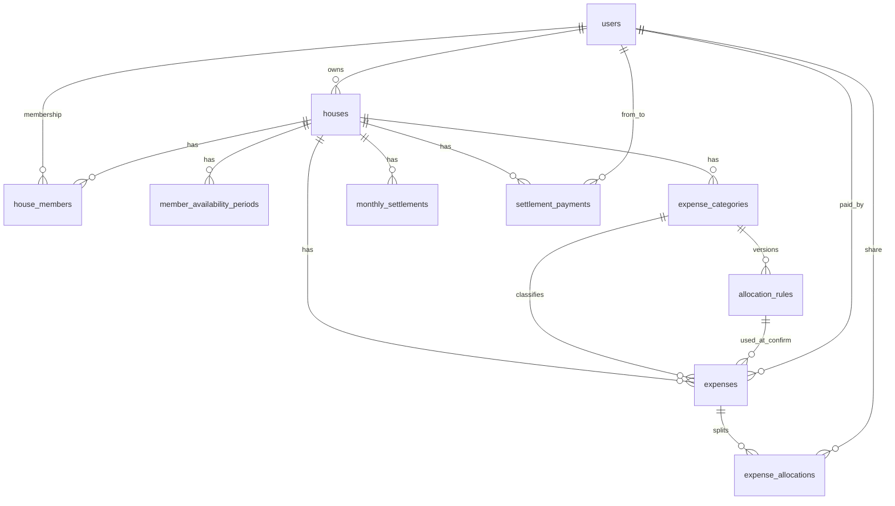

# Database Structure

House Expense Management System — MySQL schema (Laravel migrations).

Money columns use `DECIMAL(15,2)`. Status / type fields are stored as strings (backed by PHP enums in the app). Settlement **transfers** are computed in application code and are **not** stored as rows.

Related reading: [`ARCHITECTURE.md`](ARCHITECTURE.md).

---

## Entity relationship (domain)

---

## Domain tables

### `users`

Application accounts (Laravel auth + Sanctum).

| Column | Type | Notes |
|--------|------|--------|
| `id` | bigint PK | |
| `name` | string | |
| `email` | string | unique |
| `phone` | string | nullable |
| `email_verified_at` | timestamp | nullable |
| `password` | string | hashed |
| `remember_token` | string | nullable |
| `created_at`, `updated_at` | timestamps | |

Also created in the same migration (framework):

- `password_reset_tokens` — email PK, token, created_at  
- `sessions` — cookie/session store when `SESSION_DRIVER=database`

---

### `houses`

A household / shared living group.

| Column | Type | Notes |
|--------|------|--------|
| `id` | bigint PK | |
| `name` | string | |
| `description` | text | nullable |
| `owner_id` | FK → `users.id` | cascade delete |
| `currency` | string(3) | default `PKR` |
| `timezone` | string | default `Asia/Karachi` |
| `created_at`, `updated_at` | timestamps | |

---

### `house_members`

Membership of a user in a house (supports leave / rejoin history).

| Column | Type | Notes |
|--------|------|--------|
| `id` | bigint PK | |
| `house_id` | FK → `houses.id` | cascade delete |
| `user_id` | FK → `users.id` | cascade delete |
| `role` | string | `owner` \| `member` |
| `joined_at` | timestamp | membership start |
| `left_at` | timestamp | nullable; null = still active |
| `created_at`, `updated_at` | timestamps | |

**Indexes / constraints**

- unique `(house_id, user_id, joined_at)`
- index `(house_id, user_id, left_at)`

---

### `member_availability_periods`

Presence / absence intervals used for day-weighted allocation.

| Column | Type | Notes |
|--------|------|--------|
| `id` | bigint PK | |
| `house_id` | FK → `houses.id` | cascade delete |
| `user_id` | FK → `users.id` | cascade delete |
| `start_date` | date | |
| `end_date` | date | nullable = ongoing |
| `status` | string | `available` \| `unavailable` |
| `created_by` | FK → `users.id` | cascade delete |
| `created_at`, `updated_at` | timestamps | |

**Indexes**

- `map_house_user_dates_idx` on `(house_id, user_id, start_date, end_date)`
- `map_house_status_idx` on `(house_id, status)`

Only `status = available` periods contribute person-days. Overlaps for the same user/house are rejected in the service layer.

---

### `expense_categories`

Named expense buckets per house (e.g. Electricity, Grocery).

| Column | Type | Notes |
|--------|------|--------|
| `id` | bigint PK | |
| `house_id` | FK → `houses.id` | cascade delete |
| `name` | string | |
| `description` | text | nullable |
| `code` | string | stable key within house |
| `is_active` | boolean | default `true` |
| `sort_order` | unsigned int | default `0` |
| `created_at`, `updated_at` | timestamps | |

**Constraints**

- unique `(house_id, code)`

---

### `allocation_rules`

Versioned allocation configuration for a category.

| Column | Type | Notes |
|--------|------|--------|
| `id` | bigint PK | |
| `expense_category_id` | FK → `expense_categories.id` | cascade delete |
| `rule_type` | string | `per_day` \| `fixed` \| `hybrid` |
| `configuration` | json | type-specific payload (see below) |
| `effective_from` | date | |
| `effective_to` | date | nullable = open-ended |
| `version` | unsigned int | increments per category |
| `created_by` | FK → `users.id` | cascade delete |
| `created_at`, `updated_at` | timestamps | |

**Indexes / constraints**

- unique `allocation_rules_category_version_uq` on `(expense_category_id, version)`
- index `allocation_rules_category_effective_idx` on `(expense_category_id, effective_from, effective_to)`

#### `configuration` shapes (app-level)

| `rule_type` | Typical JSON |
|-------------|--------------|
| `per_day` | `{}` — split by available days in expense period |
| `fixed` | `{ "apply_to": "all_members" \| "active_members" \| "full_period_members" }` |
| `hybrid` | `{ "mode": "percentage" \| "amount_remainder", "components": [ ... ] }` |

`apply_to` / fixed hybrid slices: members with **0 available days** in the expense period receive `0.00` (absent members do not share cost).

---

### `expenses`

Household expense records.

| Column | Type | Notes |
|--------|------|--------|
| `id` | bigint PK | |
| `house_id` | FK → `houses.id` | cascade delete |
| `expense_category_id` | FK → `expense_categories.id` | cascade delete |
| `paid_by` | FK → `users.id` | who fronted the money; cascade delete |
| `title` | string | |
| `description` | text | nullable |
| `amount` | decimal(15,2) | |
| `expense_date` | date | drives which **month** settlement includes this expense |
| `period_start_date` | date | nullable; coverage for allocation / locks |
| `period_end_date` | date | nullable |
| `status` | string | `draft` \| `confirmed` \| `cancelled` (default `draft`) |
| `allocation_rule_id` | FK → `allocation_rules.id` | nullable; set on confirm; null on delete of rule |
| `created_by` | FK → `users.id` | cascade delete |
| `confirmed_at` | timestamp | nullable |
| `created_at`, `updated_at` | timestamps | |

**Indexes**

- `expenses_house_status_date_idx` on `(house_id, status, expense_date)`
- `expenses_house_period_idx` on `(house_id, period_start_date, period_end_date)`

Coverage for month-lock defaults to `[expense_date, expense_date]` when period dates are null.

---

### `expense_allocations`

Stored per-user shares written when an expense is **confirmed**. Settlement reads these rows (does not re-run allocation).

| Column | Type | Notes |
|--------|------|--------|
| `id` | bigint PK | |
| `expense_id` | FK → `expenses.id` | cascade delete |
| `user_id` | FK → `users.id` | cascade delete |
| `amount` | decimal(15,2) | this user’s share |
| `allocation_details` | json | audit: rule id/version, components, availability_days |
| `created_at`, `updated_at` | timestamps | |

**Constraints**

- unique `(expense_id, user_id)`

Zero-share members may still have a row with `amount = 0.00`.

---

### `monthly_settlements`

Month open/closed lock metadata for a house. Balances and transfers are **not** persisted here.

| Column | Type | Notes |
|--------|------|--------|
| `id` | bigint PK | |
| `house_id` | FK → `houses.id` | cascade delete |
| `year` | unsigned smallint | |
| `month` | unsigned tinyint | 1–12 |
| `status` | string | `open` \| `closed` (default `open`) |
| `total_expenses` | decimal(15,2) | snapshot at close; default `0` |
| `closed_at` | timestamp | nullable |
| `closed_by` | FK → `users.id` | nullable; null on delete |
| `created_at`, `updated_at` | timestamps | |

**Constraints**

- unique `(house_id, year, month)`

---

### `settlement_payments`

Recorded cash settlements between members (payer records → recipient confirms).

| Column | Type | Notes |
|--------|------|--------|
| `id` | bigint PK | |
| `house_id` | FK → `houses.id` | cascade delete |
| `from_user_id` | FK → `users.id` | payer; cascade delete |
| `to_user_id` | FK → `users.id` | recipient; cascade delete |
| `year` | unsigned smallint | debt month this payment applies to |
| `month` | unsigned tinyint | 1–12 |
| `amount` | decimal(15,2) | |
| `status` | string | `pending` \| `confirmed` \| `rejected` \| `cancelled` (default `pending`) |
| `note` | string | nullable |
| `recorded_by` | FK → `users.id` | cascade delete |
| `confirmed_by` | FK → `users.id` | nullable |
| `confirmed_at` | timestamp | nullable |
| `rejected_at` | timestamp | nullable |
| `created_at`, `updated_at` | timestamps | |

**Indexes**

- `settlement_payments_house_status_idx` on `(house_id, status)`
- `settlement_payments_to_status_idx` on `(house_id, to_user_id, status)`
- `settlement_payments_house_ym_status_idx` on `(house_id, year, month, status)`

Only **confirmed** payments adjust month / lifetime owing. They are applied **pairwise** (overpayment becomes credit the other way; not reshuffled to third parties).

---

## Auth / framework tables

| Table | Purpose |
|-------|---------|
| `personal_access_tokens` | Laravel Sanctum API tokens (`tokenable` morph, unique hashed `token`) |
| `cache`, `cache_locks` | When `CACHE_STORE=database` |
| `jobs`, `job_batches`, `failed_jobs` | When `QUEUE_CONNECTION=database` |
| `sessions` | When `SESSION_DRIVER=database` |
| `password_reset_tokens` | Password reset flow |

---

## What is *not* stored

| Concept | How it works |
|---------|----------------|
| Monthly “who pays whom” transfers | Computed from balances + confirmed payments |
| Lifetime / overall owing | Computed across confirmed expenses + confirmed payments |
| Category spend charts | Aggregated from confirmed expenses |

---

## Money & status conventions

| Concern | Convention |
|---------|------------|
| Amounts | `DECIMAL(15,2)`; app math via BCMath (`App\Support\Money`) |
| Enums in DB | Strings matching PHP backed enums |
| Soft deletes | Not used on domain tables |
| Delete policy | Most FKs `cascadeOnDelete`; expense→rule uses `nullOnDelete` |

---

## Migration map

| Migration | Tables / changes |
|-----------|------------------|
| `0001_01_01_000000_*` | `users`, `password_reset_tokens`, `sessions` |
| `0001_01_01_000001_*` | `cache`, `cache_locks` |
| `0001_01_01_000002_*` | `jobs`, `job_batches`, `failed_jobs` |
| `2026_08_09_181901_*` | `personal_access_tokens` |
| `2026_08_10_000001_*` | `houses` |
| `2026_08_10_000002_*` | `house_members` |
| `2026_08_10_000003_*` | `member_availability_periods` |
| `2026_08_10_000004_*` | `expense_categories` |
| `2026_08_10_000005_*` | `allocation_rules` |
| `2026_08_10_000006_*` | `expenses` |
| `2026_08_10_000007_*` | `expense_allocations` |
| `2026_08_10_000008_*` | `monthly_settlements` |
| `2026_08_16_000001_*` | `settlement_payments` |
| `2026_08_16_000002_*` | adds `year`, `month` (+ index) on `settlement_payments` |

Source of truth: `database/migrations/`. After schema changes, update this document.
